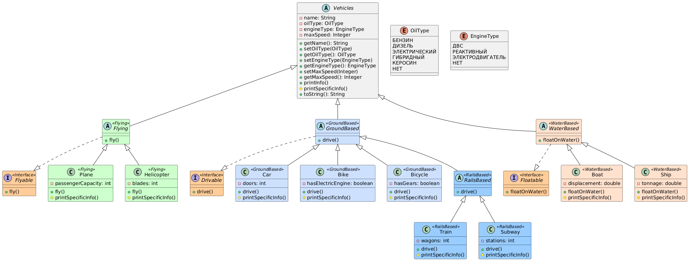

# Домашнее задание №3

## Описание программы

Данная программа реализует систему управления различными видами транспорта. 
Консольный интерфейс позволяет создавать транспортные средства, хранить их характеристики и выполнять действия, специфичные для типа транспорта.

### Особенности реализации

1. Использование **`sealed` классов** для строгого контроля наследования.  
2. Разделение транспорта на три основных типа:
    - **Летающий транспорт** (`Flying`)  
    - **Наземный транспорт** (`GroundBased`)  
        - Подтип: `RailsBased` (`Train`, `Subway`)  
    - **Водный транспорт** (`WaterBased`)  
3. Все транспортные средства наследуются от базового класса `Vehicles`, который содержит общие поля:
    - `name` — название транспорта  
    - `oilType` — тип топлива (`OilType`)  
    - `engineType` — тип двигателя (`EngineType`)  
    - `maxSpeed` — максимальная скорость  
4. Использование интерфейсов для действий:
    - `Flyable` — летать (`fly()`)  
    - `Drivable` — ездить (`drive()`)  
    - `Floatable` — плавать (`floatOnWater()`)  
5. Метод `printInfo()` выводит общую информацию о транспортном средстве, а `printSpecificInfo()` отвечает за уникальные характеристики каждого класса.  

### Использование программы

1. Запустить класс `Main`.  
2. В меню выбрать действия:  
    - Добавить транспорт  
    - Показать список созданного транспорта  
    - Выполнить действие (летать, ехать, плыть)  
3. Программа поддерживает настройку:
    - Тип двигателя и топлива  
    - Максимальной скорости  
    - Специфических параметров транспорта (двери, лопасти, количество вагонов и т.д.)  

### Иерархия классов
